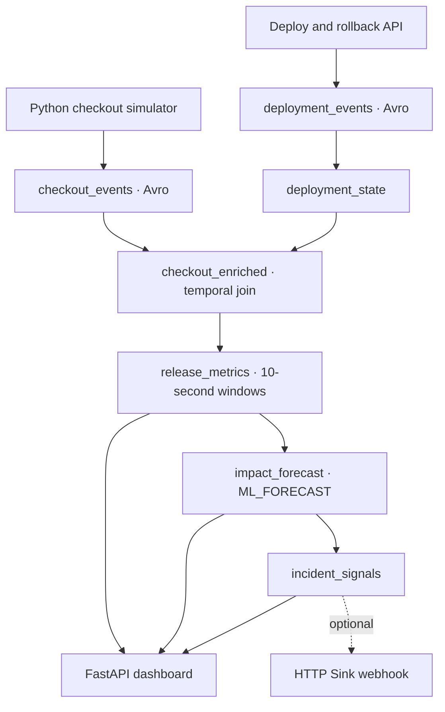

# LaunchGuard

**Predictive Release Intelligence** for checkout operations. LaunchGuard observes checkout traffic and deployment events to identify a degraded release, forecast its effect, estimate business exposure and support an operator-approved rollback.

## Architecture



Confluent Cloud Kafka carries the input and derived streams; Schema Registry governs Avro schemas. Confluent Cloud for Apache Flink performs deployment correlation, window aggregation, failure and failed-GMV forecasts, and incident and impact calculations. The Python app publishes the two input streams and displays the three Flink outputs. **LaunchGuard does not use an LLM to decide that an incident exists.**

| Topic | Origin | Purpose |
| --- | --- | --- |
| `checkout_events` | Python · Avro | Checkout outcome, segment, amount, latency |
| `deployment_events` | Python · Avro | Stable deploy, bad deploy and rollback |
| `deployment_state` | Flink | Keyed version history per service |
| `checkout_enriched` | Flink | Checkout linked to release with `FOR SYSTEM_TIME AS OF` |
| `release_metrics` | Flink | 10-second failure rate, latency and failed GMV |
| `impact_forecast` | Flink | Two `ML_FORECAST` outputs and hourly exposure |
| `incident_signals` | Flink | Severity and expected hourly loss |

The existing input Avro subject names are `checkout_events-value` and `deployment_events-value`. The SQL output tables request `avro-registry`. The input contract has no event timestamp, so the temporal join uses Kafka record time via `$rowtime`.

## Run locally

Use Python 3.11+ and the existing Confluent Cloud Kafka cluster and Schema Registry. No local broker, database, Terraform or Docker Compose is required.

```bash
python -m venv .venv
source .venv/bin/activate
pip install -r requirements.txt
cp .env.example .env
# Fill in the six values locally. Never commit .env.
python -m scripts.preflight
uvicorn app.main:app --host 0.0.0.0 --port 8000
```

On Windows PowerShell, activate with `.venv\Scripts\Activate.ps1` and copy `.env.example` to `.env` with `Copy-Item`. Open `http://localhost:8000`.

The required environment keys are `KAFKA_BOOTSTRAP_SERVERS`, `KAFKA_API_KEY`, `KAFKA_API_SECRET`, `SCHEMA_REGISTRY_URL`, `SCHEMA_REGISTRY_API_KEY`, and `SCHEMA_REGISTRY_API_SECRET`. `.env` is ignored by Git. The existing bootstrap check is available with `python -m scripts.test_producer`.

Routes: `GET /`, `GET /api/status`, `GET /api/history`, `GET /health`, `POST /api/deploy`, `POST /api/rollback`. Deployment actions succeed only after the corresponding Avro event is acknowledged by Kafka. On startup, the app retries the stable deployment before starting continuous traffic. Missing Flink topics leave the dashboard serving **WAITING FOR CONFLUENT FLINK PIPELINE** and unavailable metrics as dashes.

## Configure Flink

Use the existing `launchguard-devday` environment and `launchguard-kafka` cluster in AWS `us-east-2`. A Flink compute pool and SQL Workspace are needed. Run `flink/01_deployment_state.sql` through `flink/05_incident_signals.sql` in order in streaming mode, inspecting each materialized table and its output before the next. These SQL files are **deployment candidates, not verified against the workspace**. Confirm the inferred input table schemas with `DESCRIBE checkout_events` and `DESCRIBE deployment_events`, then adjust any workspace-specific DDL errors.

The forecast needs roughly 10 complete 10-second windows to warm up. The hourly GMV exposure is forecast failed GMV per 10-second window multiplied by 360. Expected loss applies an illustrative **35% abandonment factor**. Failed GMV is not all permanently lost revenue. **Revenue Protected** is the reduction from the observed peak expected hourly loss to the recovered expected hourly loss. It requires a real incident signal, Kafka-acknowledged rollback, 35 seconds of recovery and three distinct healthy Flink windows. It estimates reduced hourly exposure, not cash already saved. Delayed windows from before rollback and duplicate windows cannot trigger recovery. Connection badges expire when deliveries or pipeline outputs become stale.

After the core pipeline is producing results, optionally add an HTTP Sink from `incident_signals` to a temporary webhook. Verify Stream Lineage in Confluent Cloud and use a genuine screenshot. Neither the connector nor lineage is claimed as completed here.

## Demo

1. Start the app. Show healthy traffic on v2.3.7 and wait for the forecast baseline.
2. Click **DEPLOY BAD RELEASE**. The Kafka deployment record switches the simulator to v2.4.1; Brazil / PIX sees disproportionate failures.
3. Show Flink's 10-second metrics, forecast, GMV at risk, expected loss and severity.
4. Click **APPROVE ROLLBACK** to write the v2.3.7 rollback event. Watch gradual recovery.
5. Once Flink emits a healthy recovery signal, show **REVENUE PROTECTED**, the timeline and authentic Confluent lineage.

The control API has no authentication. Keep this development demo on a trusted network; do not expose it publicly without access controls.

## Submission readiness

See [the submission checklist](docs/submission.md) for the exact Developer Day form fields, evidence status and remaining work. Local tests use a mocked broker for control routes; passing tests is not evidence of a live Flink pipeline.
